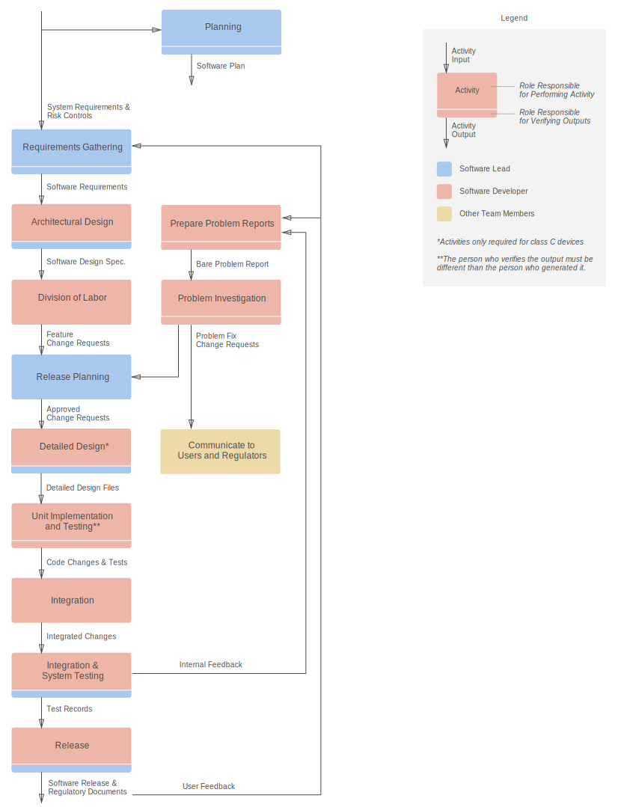

# Purpose

Engineering is about optimizing. To do it one must first know what is being optimized.

Some students go to school because they need the degree to get a job. These students optimize their actions to get the best grades for the least amount of work.  The best students go to school to learn, and while they often try to get good grades, they optimize their actions so as to learn as much as they can.

Likewise, some companies follow regulations to get certified to sell their products. They optimize everything they do to get past the regulators at the lowest cost.  The best companies follow the regulations in order to make the products safer and better, and while they are careful to fulfill the relevant regulations, they optimize their regulatory process to make their products as safe and useful as is feasible.

This document describes a set of processes which will be used during the development and maintenance of Project. It is written primarily for software developers, and it should contain all of the context for a new developer to understand and work within the processes described.

Project is assigned a Class C software safety class, which means death or serious injury could occur if the software fails.

The primary purpose of this document is to help developers ensure Project is safe and useful.  The secondary purpose is to comply with IEC62304:2006.

# Overview

## Diagram of Software Activates

## Definitions

A **process** is a set of interrelated or interacting activities that transform inputs into outputs.

An **activity** is a set of one or more interrelated or interacting tasks.

A **task** is a single piece of work that needs to be done.  Note that we do not explicitly demarcate tasks in this document.

Three terms identify the software decomposition.  The top level is the **software system**. The lowest level that is not further decomposed is the **software unit**.  All levels of composition, including the top and bottom levels, can be called **software items**.  A software system, then, is composed of one or more software items, and each software item is composed of one or more software units or decomposable software items.  See the software system design file for a description of how Project is decomposed into software items.

**SOUP**, or **software of unknown provenance**, is a software item that is already developed and generally available and that has not been developed for the purpose of being incorporated into the medical device (also known as "off-the-shelf software") or software previously developed for which adequate records of the development processes are not available.

A **problem report** is a record of actual or potential behaviour of a software product that a user or other interested person believes to be unsafe, inappropriate for the intended use or contrary to specification.  Problem reports are stored as GitHub issues with the `problem` label.

A **software requirement** is a documented aspect of how the software system should work, see [Appendix A](#architectural-design) for examples.  Software requirements are stored as GitHub issues with the `requirement` label.

A **change request** is a documented specification of a change to be made to a software product.  Change requests are stored as GitHub issues that do not have the `problem` or `requirement` labels.  All work on the software project should occur in response to change requests.

## Roles and Responsibilities

The processes described in this document are designed for a team composed of a project lead and one to four software developers.  The primary responsibilities of these roles are:

1. Project lead
    - requirements gathering
    - risk analysis
    - system architecture
    - work assignment
    - verifying pull requests
2. Software developer
    - refining requirements
    - refining system architecture
    - unit level architecture
    - implementation
    - unit and integration tests
    - investigating problem reports.

The project lead, working on behalf of the manufacturer, is responsible for the safety and utility of the software system built by the team.

## Version Control

A git repository, hosted on GitHub, should be setup at the start of the software development planning activity.  All software development and maintenance activity outputs will be stored in this git repository, the associated GitHub issues, or the associated GitHub pull requests, unless explicitly noted otherwise in the activity description.

## GitHub Issues, Labels, and Milestones

[GitHub issues](https://guides.github.com/features/issues/) are used to represent software requirements, problem reports, and change requests.  These three items are distinguished using labels.

- Software requirements have the `requirement` label
- Problem reports have the `problem` label
- Change requests are any issues without the `problem` or `requirement` label.

Software requirements are typically created by the project lead during the requirements gathering activity, but may be created as needed through out the development process.

Problem reports are typically created in response to feedback gathered from external users, or in response to anomalys detected during testing.

Change requests are created at the start of the unit implementation activity or during the problem investigation activity.  Change requests should [reference](https://help.github.com/articles/autolinked-references-and-urls/#issues-and-pull-requests) one or more software requirement or problem reports.

In order to organize and prioritize the development work, change requests are assigned to GitHub milestones.  Change requests that have not yet been assigned to a GitHub milestone have not yet been approved, and should not be worked on.

Only the project lead should associate change requests with milestones, since this approval process is explicitly required by IEC62304:2006.  Once a change request is assigned to a milestone, it has been "approved" and may be worked on by a developer.  The project lead will then assign developers to change requests to divide up the work.  Software developers may also assign themselves to change requests, so long as it is not assigned to another developer and they don't have other outstanding tickets they can work on.

## Branches and Pull Requests

Change requests are implemented using [GitHub flow](https://guides.github.com/introduction/flow/).

When beginning work on a change request with an id of `104`, developers should open a new Git branch named `104-short-description`.  All development work should occur in Git branches.

The `master` branch of the git repository should contain the most up-to-date tested version of the software system.  When work on the branch is nearing completion, a GitHub pull request should be created for this branch.  The project lead shall review and verify the changes in the branch, suggesting changes if necessary .

Git commits should be split into logical chunks, and Git commit messages should:

- explain why the current changes are being made, especially when it is not obvious
- reference the change request it was made in (the `rdm hooks` command can streamline this).

## Software Dependencies (SOUP)

SOUP, Software of Unknown Provenance, is software that is already developed and generally available and

- that has not been developed for the purpose of being incorporated into the medical device software (also known as "off-the-shelf software"), or
- software previously developed for which adequate records of the development processes are not available.

All SOUP used in Project must be recorded in a YAML file called `soup.yaml`, which we will refer to as our "software dependencies file."  The software dependencies file must contain a sequence of mappings each containing the following key and values:

- `title` - the name of the dependency 
- `manufacturer` - the organization that maintains the tool 
- `version` - e.g., `1.0.13` 
- `type` - `production` or `development`
- `requirements` - sequence of functional and performance requirements 
- `hardware` - sequence of any hardware requirements 
- `software` - sequence of any software requirements 
- `anomaly_list` - URL to published anomaly sequence 
- `purpose` - a brief explanation of how the SOUP is used in Project.

The `manufacturer` field may be `null` if the software is an open source project with no managing organization.

The `version` field may follow varying formats, such as `1.0.13`, `1.2r5`, or even `2021-05-05`, depending on how the project.

The `type` field indicates whether the SOUP must be present while the software is being used in `production`, or if it is only necessary during `development`.  For example, a compiler or testing tool is a `development` dependency.

The `requirements` field should be a sequence of requirements that Project has for the SOUP.  For example, the SOUP must provide a web server that is compliant with the HTTP1.1 standard.

The `hardware` sequence should be any known specific hardware requirements needed for the SOUP's intended use in Project.  There is no need to get carried away with this field; most of the time it will be `null`, since usually there are no specific hardware requirements.  Examples include processor type and speed, memory type and size.

The `software` sequence should include any secondary dependencies.  Each secondary dependency should have the same format as the top-level sequence, and may have its own dependencies.

The `anomaly_list` should be a URL pointing to the SOUP's published sequence of known anomalies.  It may be `null` if no sequence is known.

Whenever a change request requires new software dependencies to be added, removed, or changed, the software dependencies file should be updated within the same pull request.

The software dependencies file may cause duplication with other software development files (e.g., `requirements.txt` or `package.json`).  Also, it is recognized that keeping track of secondary dependencies can require significant effort---think carefully before adding new SOUP to Project.

## Development Tools

The technical lead should keep an up-to-date list of development tools here.

## Development Standards

The technical lead should keep an up-to-date list of development standards here (e.g., PEP8 on a Python project).

# Development Process

## Development Life Cycle Model

Project will be developed using an evolutionary software development life cycle model.  The evolutionary strategy develops the software system using a sequence of builds.  Customer needs and software system requirements are partially defined up front, then are refined in each succeeding build.

## Development Planning Activity

**Input:** Nothing

**Performed by:** Project Lead

The planning document must be kept up to date as the project commences.

Each development activity should indicate its:

- required inputs
- which role should perform the activity
- deliverables (also referred to as outputs)
- output verification steps (if there are any)
- which role should perform the verification.

Since we are using an evolutionary development life cycle, activities typically are performed before their inputs are fully settled.  As a result, activity inputs and outputs may not be internally consistent during the development process.

Before each software release, the team should verify the deliverables of each development activity to ensure they are in a consistent state.  The project lead should accept the release based on the consistency of the various development activity outputs.

Software standards (e.g., PEP8 on a python project) should be agreed upon and recorded in this document.  To the extent possible, checking against these standards should be performed in an automated fashion (e.g., using a linter which is run on a git-commit hook).

**Output:** The markdown version of this plan document.

## Requirements Analysis Activity

**Input:** System requirements and risk controls

System requirements are recorded in Greenlight Guru.  Each system requirement requires a unique identifier so that we can trace its related software requirements back to it using GitHub labels.

To the extent possible, software requirements should be enumerated at the start of the project.  If an existing requirement becomes irrelevant, it should be tagged with the `obsolete` label.  Software requirements should be tied to their originating system requirements by tagging them with labels that match the system requirement ids.

Writing software requirements is an art and a science; one must find balance between precision and usefulness.

Software requirements are often categorized as one of the following types:

a. Functional and capability requirements
  - performance (e.g., purpose of software, timing requirements),
  - physical characteristics (e.g., code language, platform, operating system),
  - computing environment (e.g., hardware, memory size, processing unit, time zone, network infrastructure) under which the software is to perform, and
  - need for compatibility with upgrades or multiple SOUP or other device versions.

b. Sofware system inputs and outputs
  - data characteristics (e.g., numerical, alpha-numeric, format) ranges,
  - limits, and
  - defaults.

c. Interfaces between the software system and other systems

d. Software-driven alarms, warnings, and operator messages

e. Security requirements
  - those related to the compromise of sensitive information,
  - authentication,
  - authorization,
  - audit trail, and
  - communication integrity.

f. Usability engineering requirements that are sensitive to human errors and training
  - support for manual operations,
  - human-equipment interactions,
  - constraints on personnel, and
  - areas needing concentrated human attention.

g. Data definitions and database requirements

h. Installation and acceptance requirements of the delivered medical device software at the operation and maintenance site or sites

i. Requirements related to methods of operation and maintenance

j. User documentation to be developed

k. User maintenance requirements

l. Regulatory requirements

m. Risk control measures

Software requirements that implement risk controls should be tied to their originating risk control by tagging them with labels that match the risk control ids.

When software requirements are added or changed, re-evaluate the medical device risk analysis and ensure that existing software requirements, and system requirements, are re-evaluated and updated as appropriate .

**Output:** Software requirements with clearly written descriptions

**Output Verification:** Ensure software requirements:

- implement system requirements and are labeled with system requirement ids
- implement risk controls and are labeled with risk control ids
- don't contradict each other
- have unambiguous descriptions
- are stated in terms that permit establishment of test criteria and performance of tests to determine whether the test criteria have been met.

## Architectural Design Activity

**Input:** Software requirements

After the initial set of requirements have been gathered, develop an initial software system architecture and document it in a file named `DESIGN.md` in the root of the project's git repository.  This file, which we will refer to as the software system design file, should describe how the software system is divided into software items, and whether these software items are further divided, and so on until the software items are divided no further.

Software units are often thought of as being a single function or module, but this is not always appropriate.  Software units must be able to be tested independently, and software items should be divided in a way such that parallels the directory structure of the project.

Show the software and hardware interfaces between the software items and external software components.  Prefer block diagrams and flow charts to textual descriptions, and include these diagrams in the design file.

Indicate which software items are SOUP.  Include a section in the design files that specifies functional and performance requirements for any SOUP items, as well as any hardware or software that is necessary for its intended use.

Identify any segregation between software items that is essential to risk control, and state how to ensure that the segregation is effective.  For example, one may segregate software items by running them on different processors.

The initial architecture does not need to be complete or final, since code construction often helps guide architectural decisions, however, it is worth spending a significant amount of time on the initial architecture.

**Output:** Design files

**Output Verification:** Ensure software architecture documented in the design files:

- implements system and software requirements
- is able to support interfaces between software items and between software items and hardware
- is such that the medical device architecture supports proper operation of any SOUP items.

## Detailed Design Activity

**Input:** Software system design file

In addition to the software system design file, each software item requires its own detailed design.  These detailed designs should be stored as close as possible to their corresponding source files.  For example if a software item is a:

- directory then its detailed design should be stored in a file called `DESIGN.md` in that directory
- file then its detailed design should be stored in a block comment at the top of the file
- function then its detailed design should be stored in a block comment adjacent to the function.

The location of these detailed designs should be indicated in the software system design file.

Detailed designs for interfaces between software items and external components (hardware or software) should be included as appropriate.

**Output:** Software item designs

**Output Verification:** Ensure software requirements:

- implements system and software requirements
- is free from contradiction with the software system design file.

## Unit Implementation Activity

**Input:** Detailed software item designs and software requirements

Implement, or partially implement, one or more software items in a new git branch.
Write unit tests and new integration tests as appropriate.

**Output:** Code changes, stored in un-merged git branches with corresponding pull requests

**Output Verification:** Ensure the code changes made in the git branch:

- completes any software requirements it claims to close
- is consistent with the related detailed designs
- follows the project's software standards
- includes unit tests or justifies why they are not necessary
- is covered by existing integration tests or includes a new integration test.

## Integration and Integration Testing Activity
## System Testing Activity

## Release Activity

**Input:** Implemented and verified change requests for the current milestone

When a new version of the software is released, the git commit corresponding to the state of the code should be [tagged](https://git-scm.com/book/en/v2/Git-Basics-Tagging) with the version number.

**Output:** A software release.

# Maintenance Process

## Problem Analysis Activity

Feedback from users, internal testers, and software developers will be recorded in User Feedback Software.

# Risk Management Process

# Problem Resolution Process

## Prepare Problem Report Activity

**Input:** Feedback from users or other members of the development team.

Problem reports are stored as GitHub issues tagged with the `problem` label.

When creating a new problem report, include in the issue description:

- The type of problem
- The scope of the problem
- The criticality of the problem
- Any relevant relevant information that can be used to investigate the problem.

**Output:** Properly formatted and labeled GitHub issues.

## Problem Investigation Activity

**Input:** GitHub issue containing relevant details about the problem.

1. Investigate the problem and if possible identify the cause and record it in comments in the GitHub issue.
2. Evaluate the problem's relevance to safety using the software risk management process 
3. Document the outcome of the investigation and evaluation
4. Create a GitHub issue tagged with the label `request` for actions needed to correct the problem (also include an issue reference to the problem report), or document the rationale for taking no action.
5. Look through recent problem reports and attempt to identify any adverse trends.  E.g., look to identify certain software items that are failing consistently or have similar causes.  If any trends can be identified, be sure the change requests reverse these trends.

**If the problem affects devices that have been released, the software developer will make sure quality control is aware of the situation and has enough information to decide whether and how to notify affected parties.**

**Output:** Details about the problem investigation documented in the problem report and either unapproved change requests or justification as to why change requests weren't necessary.

## Implement Change Requests

**Input:** Approved change requests

Once the change requests have been approved, implement them according to our change control process.

**Output:** Code changes required to implement change requests

**Output Verification:** Ensure code changes:

- all of the change requests have been implemented and merged into the `master` branch
- the original problem is fixed and the problem report closed
- any adverse trends have been reversed.

# Documents