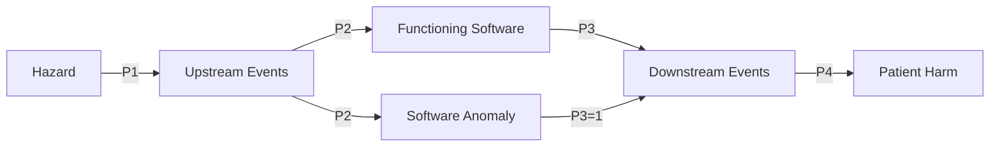
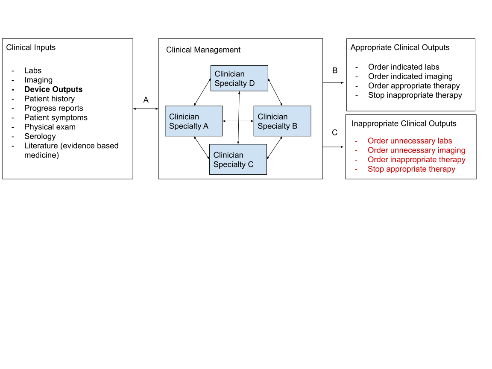
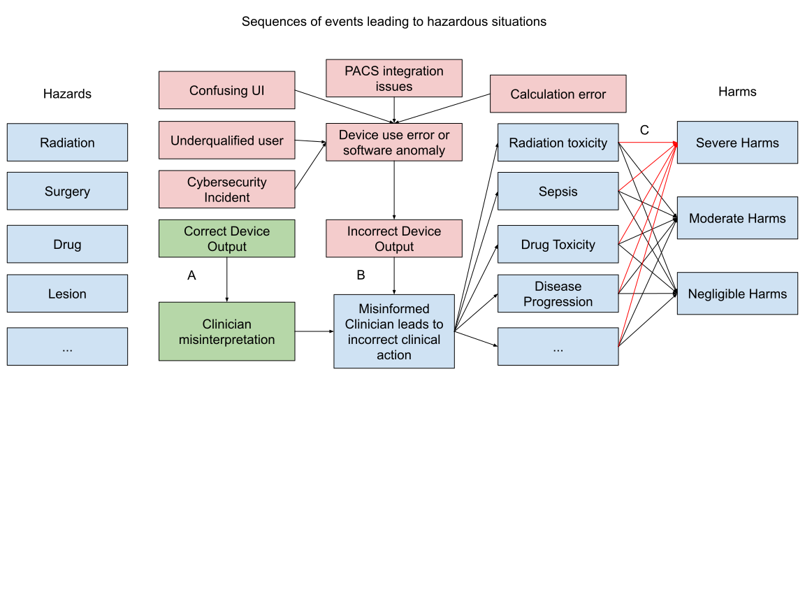

# Risk Management Process

## Definitions and Acronyms

An SME is a subject matter expert.

An RCM is a risk control measure.

A harm is a physical injury or damage to the health of people, or damage to the property or the environment.

A hazard is a potential source of harm.

A hazardous situation is a circumstance in which people, property, or the environment are exposed to one or more hazards.

An intended use is the use for which the product, process or service is intended according to the specifications, instructions and information provided by the manufacturer.

Post production refers to the life cycle of the product after the design has been completed and the medical device has been manufactured. 

A procedure is a specific way to carry out an activity or process.

A process is a set of interrelated or interacting activities which transforms inputs into outputs.

A record is a document stating results achieved or providing evidence of activities performed.

Residual risk is the risk remaining after risk control measures have been taken.

A risk is a combination of the probability of occurrence of harm and the severity of that harm.

Risk analysis is the systematic use of available information to identify hazards and to estimate the risk.

Risk assessment is the overall process comprising a risk analysis and risk evaluation.

Risk control is a process in which decisions are made and measures implemented by which risk are reduced to, or maintained within, specified levels.

Risk estimation is a process used to assign values to the probability of occurrence of harm and the severity of that harm.

Risk management refers to the systematic application of management policies, procedures and practices to the tasks of analysing, evaluating, controlling, and monitoring risks

Risk management process (this document) documents the processes for identifying hazards, estimating and evaluating the associated risks, controlling these risks, and monitoring the effectiveness of the controls. This is the “what” needs to be done for risk management.

The Risk management plan shall outline who and when components of the risk management process shall be performed. This is the “who” and “when” of risk management.

Risk management file is a set of records and other documents that are produced by the risk management process.

Safety is the freedom from unacceptable risk.

Severity is the measure of the possible consequences of a hazard.

A use error is an act or omission of an act that results in a different medical device response than intended by the manufacturer or expected by the user.

Verification is the confirmation, through the provision of objective evidence, that specified requirements have been fulfilled.

Practicability refers to the ability of a manufacturer to reduce the risk.

Technical practicality refers to the ability to reduce the risk regardless of cost.

Economic practicality refers to the ability to reduce the risk without making the medical device an unsound economic proposition.

A benefit, in the purview of a risk/benefit analysis, is related to the likelihood and extent of improvement of health expected from the use of the device. 

The term “Software as a Medical Device” (SaMD) is defined as software intended to be used for one or more medical purposes that perform these purposes without being part of a hardware medical device.

A serious injury is an injury or illness that:

i. is life threatening;

ii. results in permanent impairment of a body function or permanent damage to a body structure; or

iii. necessitates medical or surgical intervention to preclude permanent impairment of a body function or permanent damage to a body structure.

A formative process is one conducted iteratively during the design and development of the medical device. 

A summative process is one that is conducted during specific checkpoints, typically a release, during the design and development of the medical device. A summative process is akin to a final exam whereas a formative process is more like a pop quiz. 

## Introduction

This risk management plan outlines the established plan for an ongoing process for identifying hazards associated with our medical device, evaluating the associated risks, controlling these risks, and monitoring the effectiveness of the risk control measures. 

## Personnel Qualification

Risk management is a multidisciplinary process that must involve specialists from multiple fields. The personnel roles and qualifications are listed below:

| Role                   | Description                                                  |
| ---------------------- | ------------------------------------------------------------ |
| Medical SME            | An individual with medical expertise sufficient to foresee hazardous situations from the normal and abnormal use of the medical device in clinical use. |
| Engineering SME        | An individual with technical expertise sufficient to foresee sequences of events within the software that could lead to hazardous situations. This role includes a working knowledge of cybersecurity. This role is necessary to evaluate technical practicability. |
| Product Management SME | An individual that can bridge the gap between user needs, engineering, timeline, and budget. This individual is necessary to evaluate economic practicability. |
| Product Support SME    | An individual experienced in supporting the product in the field sufficient to foresee sequences of events that could lead to hazardous situations related to the install, use, and logistical aspects of the medical device. |
| Risk Management SME    | An individual experienced in the ISO 14971, 62366, 62304, and 80002 standards sufficient to guide the risk management activity. |

## Risk Evaluation Matrix

Risk quantification shall use the qualitative risk matrix as shown below.

|          | Negligible | Moderate | Severe |
| -------- | ---------- | -------- | ------ |
| Frequent | Medium     | Medium   | High   |
| Possible | Low        | Low      | Medium |
| Remote   | Low        | Low      | Low    |

Table 1: Risk evaluation matrix

Risk levels are defined:

| Risk Level | Risk Acceptability                           |
| ---------- | -------------------------------------------- |
| Low        | Acceptable risk                              |
| Medium     | Acceptable only with risk / benefit analysis |
| High       | Unacceptable risk                            |

Severity levels are defined as the following:

| Severity Level       | Description                                   |
| -------------------- | --------------------------------------------- |
| Significant Severity | Death or loss of function                     |
| Moderate Severity    | Reversible or minor injury                    |
| Negligible Severity  | Will not cause injury or only slightly injure |

Probability levels are defined as the following:

| Probability level | Description                       |
| ----------------- | --------------------------------- |
| Frequent          | Likely to happen, frequent, often |
| Possible          | Can happen, but not frequent      |
| Remote            | Unlikely to happen, rare, remote  |

## Process Based Risk Control Measures

Risk reduction may be achieved by specific risk control measures to mitigate individual risks. Additionally, the manufacturer’s processes, including this document, are also risk control measures. The following risk control measures are process based and lower the overall risk profile of the entire device:

1. 62304 compliant software design and development plan with 14971 compliant iterative risk analysis built in. Additional risks may be introduced in the post market phase and the software design and development plan must minimise the chance these risks go undetected.

2. 14971 compliant risk management plan (this document)

3. Formative risk management activity performed during:

4. 1. Change request code review
   2. Change request creation

5. Summative risk analysis activity performed at the end of a product release cycle. 

## Risk Management Activity

The risk management process is intended to be executed iteratively during the product development cycle (formative risk analysis) and holistically at the end of a product development cycle before a new version of the device is released (summative risk analysis.) The term “relevant” is used extensively and has a different meaning for formative vs summative activities. Relevant items in a formative activity refers to software units pertinent to a change request. Relevant items in a summative activity refers to the entire device. The following are the steps involved in the risk management activity:

1. Intended use and identification of characteristics related to the safety of the medical device.

2. 1. Use Annex C of ISO 14971:2007(E) 
   2. Review any recommendations from Annex C of 14971

3. Document any foreseeable misuse.

4. Identify hazards and hazardous situations

Figure 1. Diagram depicting upstream and downstream events leading to harm. 

1. A combination of top down and bottom up approach shall be used. The procedure shall be iterative until no further hazards or foreseeable sequences of events can be identified. 

2. Bottom up approach:

3. 1. Systematically iterate through relevant software units and record normal use and fault conditions that could lead to hazardous situations.

   2. Iterate through relevant SOUP items and record normal and fault conditions that could lead to hazardous situations.

   3. (Summative only) Take a look at reported adverse events related to the device product code that lead to patient injury or death since the last risk review.

   4. 1. A useful database of these reports are here: https://www.accessdata.fda.gov/scripts/cdrh/cfdocs/cfMAUDE/search.CFM

4. Top down approach

5. 1. Identify relevant hazards that could lead to patient harm arising from the normal use or fault condition of the medical device.
   2. Identify relevant foreseeable sequences of events that could lead to hazardous situations.
   3. Identify relevant risk control measures that would be worthwhile to implement even before risk evaluation. These identified risk control measures may later be deemed unnecessary, as such is the case if a pre mitigation risk rating is low, however, they may be desirable usability improvements worth implementing anyway. More importantly, identifying risk control measures is often a good springboard for identifying hazardous situations. Use these identified risk control measures to iteratively identify new hazards and hazardous situations.

1. Estimate risk

2. 1. For each relevant hazardous situation, assign a probability and severity rating in accordance to the risk evaluation matrix. Note that a hazardous situation will have multiple events, each with their own probability. Events related to software failure are assumed to have a probability of 1. Events related to usability --usually downstream to the device-- such as the probability that misinformation can lead to inappropriate medical decision making, requires the insight of a medical SME. Events related to the software environment -- usually upstream to the device-- requires the insight of an engineering and product support SME.

3. Risk evaluation

4. 1. Identify the relevant risks requiring mitigation using the risk evaluation matrix and risk acceptability threshold. 

5. Risk control

6. 1. For all relevant risks requiring mitigation, perform the following:

   2. 1. Brainstorm risk reduction techniques in the following order of precedence from most preferred to least:

      2. 1. Inherent safety by design

         2. 1. Eliminates the probability of the risk.

         3. Protective measures

         4. 1. Reduces the probability of the risk.

         5. Information for safety

         6. 1. Marginally reduces the probability of the risk.

      3. All members of the risk analysis team are required to identify risk control measures that satisfy both economic and technical practicability. This step shall repeat until one of two conditions are met: 

      4. 1. The residual risk, assuming all proposed risk control measures are correctly implemented and verified, falls to a negligible level. The manufacturer is still encouraged to implement additional risk control measures if they improve the usability and safety of the medical device and are economically practicable. Note: In general, an RCM in a diagnostic medical device cannot reduce the severity of harm because the medical device only contributes to the probability of a hazardous situation but cannot modulate the hazard itself. In contrast, software controlling a treatment device, such as a surgical cauterization tool, may limit the output power when a hazardous situation is detected.
         2. No further practicable measures are identified.

      5. Residual risks falling under category Low are acceptable with no further required mitigation. Residual risks under category High are unacceptable and further mitigation is required. Residual risks under Medium require a risk benefit analysis.

      6. Risk management team shall perform a risk/benefit analysis for any residual risks falling under risk category Medium. A medical SME is required for this step. 

      7. 1. Provide a justification for why the manufacturer believes the benefit of using the medical device outweighs the residual risk. The following tools may be used in the justification statement:

         2. 1. Direct comparison to existing products. 
            2. Compare the risks in the current standard of care to the new state of the art using the device. For a device that provides patient benefit primarily by reducing risk in the standard of care workflow, this approach is usually the most straightforward and appropriate.

      8. For each risk control measure identified, add a product requirement and follow design and development procedures for requirement implementation and testing.

   3. Risk control verification

   4. 1. For each risk control measure, ensure a suitable verification test has been created and performed.
      2. For each risk control measure, ensure no new risks are introduced.

### Modular Hazards and Harm Identification

Our device produces outputs that need to be interpreted by a trained clinician intended to inform clinical management. Clinical management is a complex interaction between clinicians and available information from multiple sources. There are many permutations of inputs and outputs that could lead to patient harm and it is impractical to explicitly consider all paths in our risks and hazards analysis process. We have devised a modular hazards and harm identification process that allows us to focus on our device’s contribution to risk.

Figure 3. Clinical Management Schematic. The clinical management process converts clinical inputs into clinical outputs. A) Clinical inputs are interpreted by clinicians. Clinicians may order more clinical inputs. Some clinical inputs may be incorrect or incorrectly interpreted by clinicians. There may also be communication errors between clinicians. B) Ideally, clinical inputs, both correct and incorrect, are correctly processed by clinicians to produce appropriate clinical outputs. What constitutes “appropriate clinical outputs” is outside of our control and constantly changing with advancements in the practice of medicine. C) Examples of reasons for Inappropriate clinical outputs include: clinicians misinterpreting correct clinical inputs, incorrect clinical inputs, or communication errors between clinicians.

Figure 4. Modular hazards and harm analysis schematic. This figure shows the ways our medical device can contribute to a hazardous situation. Since our device is meant to inform the clinician, a misinformed clinician is present in any foreseeable sequence of events. Our device’s output is just one piece of information that influences the clinical decision making process. We have identified two ways our device can contribute to a hazardous situation: A) a misinterpreted correct report or an B) incorrect report. Our hazard identification process will focus on identifying how our device can lead to these two events. A misinformed clinician may make an incorrect clinical management decision that could lead to patient harm. C) Every hazardous situation has a non-zero probability of leading to severe harm. For example, a misinformed clinician could order an unnecessary CT scan with contrast. Some patients may be unharmed, others may have a mild reaction, others may go into anaphylactic shock that leads to death. Another example is the incorrect cessation of chemotherapy. Some patients may already have incurable disease and ceasing chemotherapy did not cause harm. Other patients could have progression from a curable to an incurable disease. The practice of medicine is constantly evolving so it is not practical for the manufacturer to enumerate all hazards and hazardous situations, however, we have identified some guiding principles that allows us to mitigate risk without enumerating all the ways a clinician can use information to make an incorrect decision:

1. All foreseeable sequences of events contain misinformed clinician(s). 

2. Our device can contribute to a hazardous situation only through misinformed clinician(s).

3. 1. Our device is informational only. It does not directly interface to any other device that could directly cause harm.

4. Our device can contribute to a misinformed clinician through:

5. 1. Incorrect outputs due to software anomalies or use errors
   2. Correct outputs that are misinterpreted by the clinician

6. All hazards have a nonzero probability of leading to a severe harm. Examples:

7. 1. Unnecessary surgery may cause correctable injury to some but sepsis and death for others. 
   2. Unnecessary drugs (chemotherapy, contrast agent, etc) could cause mild discomfort for some but anaphylaxis and death for others.
   3. Premature termination of chemotherapy could cause no additional harm for terminal patients but incurable disease progression for others.

8. Probability of a software anomaly is assumed to be a 1.

9. 1. Design controls, verification, and validation activities can reduce the number of software anomalies, however, they cannot reduce the number to 0.

10. Probabilities of the following need to be evaluated on a case by case basis:

11. 1. Upstream sequences of events leading to a misinformed clinician. An engineering SME is best suited to evaluate this because these events are usually technical in nature.
    2. Downstream sequences events causing misinformed clinician(s) to make an incorrect clinical action. A medical SME is best suited to evaluate this because these events are usually clinical in nature. The medical SME needs to gauge how likely a clinician is to misinterpret the report and how likely the error will not be caught by other clinicians, technicians, surgeons, and other members of the clinical management team.

12. Risk control measures implemented in our device can only decrease the probability of harm. Our device cannot modulate the severity of harm because our involvement is minimal after the information is given to the clinician.

## Usability Considerations

The following types of use errors shall be considered during risk analysis [[IEC 62366-1:2015]]:

- Use error caused by failure see visual information
- Use error caused by inability to hear auditory information
- Use error caused by cognition errors
  - Inability to recall knowledge
  - Forgetting to perform a planned step
  - Unsuitable application of otherwise accepted rule
  - Misinterpretation of information due to incorrect mental models or assumptions
  - Improvisation under unusual circumstances.

## Software as a Medical Device Qualification

The following table shall be reviewed during summative risk management activities.

| IMDRF Statement                                              | Comment                                                      |
| ------------------------------------------------------------ | ------------------------------------------------------------ |
| SaMD is a medical device and includes in-vitro diagnostic (IVD) medical device. | Applies to our device.                                       |
| SaMD is capable of running on general purpose (non-medical purpose) computingplatforms. | Applies to our device.                                       |
| “without being part of” means software not necessary for a hardware medical deviceto achieve its intended medical purpose. | Applies to our device.                                       |
| SaMD may be used in combination (e.g., as a module) with other products includingmedical devices. | Applies to our device.                                       |
| SaMD may be interfaced with other medical devices, including hardware medicaldevices and other SaMD software, as well as general purpose software. | Applies to our device.                                       |
| Mobile apps that meet the definition above are considered SaMD. | Not applicable to our device but not necessary for SaMD designation. |
| SaMD may also:• Provide means and suggestions for mitigation of a disease.• Provide information for determining compatibility, detecting, diagnosing,monitoring or treating physiological conditions, states of health, illnesses orcongenital deformities.• Aid to diagnosis, screening, monitoring, determination of predisposition;prognosis, prediction, determination of physiological status. | Applies to our device.                                       |

## Factors SaMD Influencing Patient Safety

The IMDRF outlines several useful aspects to consider for SaMD.

The following table shall be reviewed during summative risk analysis activities.

| IMDRF consideration                                          | Comment                                                      |
| ------------------------------------------------------------ | ------------------------------------------------------------ |
| The type of disease or condition                             |                                                              |
| Fragility of the patient with respect to the disease or condition | Our device provides information that is used, in conjunction with other information, by a trained clinician to make a clinical decision. |
| Progression of the disease or the stage of the disease/condition | Device malfunction is unlikely to result in disease progression |
| Usability of the application                                 | Usability engineering is considered in our risk management activities. |
| Designed towards a specific user type                        | We have identified multiple user roles and have outlined the expected qualifications for each user type in product labelling. We have also considered the users qualifications in the user interface design and risk analysis. |
| Level of dependence or reliance by the user upon the output information | We have considered this factor in our risk management activities. |
| Ability of the user to detect an erroneous output information | We have considered this factor in our risk management activities. Our reports and visualizations are immediately reviewed by the user and are designed to allow users to easily detect erroneous information. |
| Transparency of the inputs, outputs and methods to the user  | We have considered this factor in our risk management activities. |
| Level of clinical evidence available and the confidence on the evidence | We have considered this factor in our risk management activities. |
| The type of output information and the level of influence on the clinical intervention | We have considered this factor in our risk management activities. |
| Complexity of the clinical model used to derive the output information | We have considered this factor in our risk management activities. |
| Known specificity of the output information                  | We have considered this factor in our risk management activities. |
| Maturity of clinical basis of the software and confidence in the output | We have considered this factor in our risk management activities. |
| Benefit of the output information vs. baseline               | We have considered this factor in our risk management activities. |
| Technological characteristics of the platform the software are intended to operate on | We have considered this factor in our risk management activities. |
| Method of distribution of the software                       | We have considered this factor in our risk management activities. |

## Factors important for SaMD Characterization

### Significance of information provided by SaMD to healthcare decision

The following table shall be reviewed during summative risk management activities.

| From IMDRF Guidance                                          | Comments                                   |
| ------------------------------------------------------------ | ------------------------------------------ |
| **To treat or to diagnose**Treating and diagnosing infers that the information provided by the SaMD will be used to take an immediate or near term action:• To treat/prevent or mitigate by connecting to other medical devices, medicinal products, general purpose actuators or other means of providing therapy to a human body• To diagnose/screen/detect a disease or condition (i.e., using sensors, data, or other information from other hardware or software devices, pertaining to a disease or condition) | This is not the best matching designation. |
| **To drive clinical management**Driving clinical management infers that the information provided by the SaMD will be used to aid in treatment, aid in diagnoses, to triage or identify early signs of a disease or condition will be used to guide next diagnostics or next treatment interventions:• To aid in treatment by providing enhanced support to safe and effective use of medicinal products or a medical device.• To aid in diagnosis by analyzing relevant information to help predict risk of a disease or condition or as an aid to making a definitive diagnosis.• To triage or identify early signs of a disease or conditions. | This is not the best matching designation. |
| **To Inform clinical management**Informing clinical management infers that the information provided by the SaMD will not trigger an immediate or near term action:• To inform of options for treating, diagnosing, preventing, or mitigating a disease or condition.• To provide clinical information by aggregating relevant information (e.g., disease, condition, drugs, medical devices, population, etc.) | **This is the best matching designation**  |

### Healthcare Situation or Condition

The following table shall be reviewed during summative risk management activities.

| From IMDRF Guidance                                          | Comments                                   |
| ------------------------------------------------------------ | ------------------------------------------ |
| **Critical situation or condition**Situations or conditions where accurate and/or timely diagnosis or treatment action is vital to avoid death, long-term disability or other serious deterioration of health of an individual patient or to mitigating impact to public health. SaMD is considered to be used in a critical situation or condition where:The type of disease or condition is:Life-threatening state of health, including incurable states,Requires major therapeutic interventions,Sometimes time critical, depending on the progression of the disease or condition that could affect the user’s ability to reflect on the output information.Intended target population is fragile with respect to the disease or condition (e.g.,pediatrics, high risk population, etc.)Intended for specialized trained users. | This is not the best matching designation. |
| **Serious situation or condition**Situations or conditions where accurate diagnosis or treatment is of vital importance to avoid unnecessary interventions (e.g., biopsy) or timely interventions are important to mitigate long term irreversible consequences on an individual patient’s health condition or public health. SaMD is considered to be used in a serious situation or condition when:The type of disease or condition is:Moderate in progression, often curable,Does not require major therapeutic interventions,Intervention is normally not expected to be time critical in order to avoid death, long-term disability or other serious deterioration of health, whereby providing the user an ability to detect erroneous recommendations.Intended target population is NOT fragile with respect to the disease or condition.Intended for either specialized trained users or lay users.  Note: SaMD intended to be used by lay users in a "serious situation or condition" as described here, without the support from specialized professionals, should be considered as SaMD used in a "critical situation or condition". | **This is the best matching designation.** |
| **Non-Serious situation or condition**Situations or conditions where an accurate diagnosis and treatment is important but not critical for interventions to mitigate long term irreversible consequences on an individual patient's health condition or public health. SaMD is considered to be used in a non-serious situation or condition when:The type of disease or condition is:Slow with predictable progression of disease state (may include minor chronic illnesses or states),May not be curable; can be managed effectively,Requires only minor therapeutic interventions, andInterventions are normally noninvasive in nature, providing the user the ability to detect erroneous recommendations.Intended target population is individuals who may not always be patients.Intended for use by either specialized trained users or lay users. | This is not the best matching designation. |

### SaMD Categorization

The following table shall be reviewed during summative risk management activities.

| State of Healthcare situation or condition | Treat or diagnose | Drive clinical management | <u>inform clinical management</u> |
| ------------------------------------------ | ----------------- | ------------------------- | --------------------------------- |
| Critical                                   | IV                | III                       | II                                |
| <u>Serious</u>                             | III               | II                        | <u>I</u>                          |
| Non-serious                                | II                | I                         | I                                 |

Our assessment of the significance of information and state of healthcare situation or condition indicates our device falls under the IMDRF category I. Information provided by the device is an aggregation of data to provide clinical information that will not trigger an immediate or near term action for the treatment of a patient condition that is not normally expected to be time critical in order to avoid death, long-term disability, or other serious deterioration of health.

### Post Market Surveillance

The following table shall be reviewed during summative risk management activities.

| IMDRF Consideration                                          | Comment                                                      |
| ------------------------------------------------------------ | ------------------------------------------------------------ |
| Due to its non-physical nature, a SaMD may be duplicated and numerous copies and widely spread, often outside the control of the manufacturer. | We have taken this into consideration during our risk management activities. |
| Often an update made available by the manufacturer is left to the user of the SaMD to install. Manufacturers should make sure that appropriate mitigations address any risks that arise from the existence of different versions of the SaMD on the market. | We have taken this into consideration during our risk management activities. |
| Incident investigations should consider any specific case or combination of use cases that may have contributed to the failure and as appropriate manufacturers should consider accident reconstruction principles, e.g., data logging, black box recorder, etc. | We have taken this into consideration during our risk management activities. |

### Socio-technical environment considerations

The following table shall be reviewed during summative risk management activities.

| IMDRF Consideration                                          | Comment                                                      |
| ------------------------------------------------------------ | ------------------------------------------------------------ |
| Manufacturers should be aware of the socio-technical environment where inadequate considerations could lead to incorrect, inaccurate, and/or delayed diagnoses and treatments; and/or additional cognitive workload (which may, over time, make clinicians more susceptible to making mistakes) | We have taken this into consideration during our risk management activities. |
| If the user does not have sufficient skills and expertise for correct operation of the SaMD, possible inaccurate output data may not be questioned. The same may happen if the user becomes habituated and over-reliant on SaMD over time. | We have taken this into consideration during our risk management activities. |
| The user may seek alternate pathways to achieve a particular functionality, otherwise called a workaround. When workarounds circumvent built-in safety features of a product, patient safety may be compromised. | We have taken this into consideration during our risk management activities. |
| Transparency of information on limitations with algorithms, clinical model, quality of data used to build the models, assumptions made, etc. can help users question the validity of output of the SaMD and avoid making incorrect or poor decisions; | We have taken this into consideration throughout the product's design, development, and installation. |
| Integrating SaMD within real-world clinical workflows (including sufficient involvement of users from all relevant disciplines) requires attention to in situ use and tasks to ensure appropriate use of safety features; | We have taken this into consideration throughout the product's design, development, and installation. |
| SaMD (and other systems connected to the SaMD) may be configured by the user in different ways than intended or foreseen by the manufacturer; | We have taken this into consideration throughout the product's design, development, and installation. |
| Though not specific to SaMD, design of the user interface including: whether designs are overly complex (e.g., multiple, complicated screens), the appropriateness of designs for the target platform (e.g., smart phone screen versus desktop monitor), the dynamic nature of data (e.g., showing information at appropriate times and for an appropriate duration); | We have taken this into consideration throughout the product's design, development, and installation. |

### Technology and system environment considerations

The following table shall be reviewed during summative risk management activities.

| IMDRF Consideration                                          | Comments                                                     |
| ------------------------------------------------------------ | ------------------------------------------------------------ |
| Connections to other systems (e.g., reliability of the connection, resilience, quality of service, access, security, load capacity of connections to other systems and connection methods, system integration) | We have taken this into consideration throughout the product's design, development, and installation. |
| Presenting information to the users and system integrators about the system requirements and resultant performance of the SaMD (e.g., the effect that changes to firewall rules might have on the operation of the system) | We have taken this into consideration throughout the product's design, development, and installation. |
| Hardware platform(s)—such as smart phones, PC, servers—(e.g., reliability, dependencies, and interconnections with others hardware and software) | We have taken this into consideration throughout the product's design, development, and installation. |
| Operating system(s) platform—such as Windows, GNU/Linux—compatibility; and | We have taken this into consideration throughout the product's design, development, and installation. |
| Modifications and changes to the SaMD integration (e.g., platform updates) may have effects on SaMD that the manufacturer did not anticipate/foresee. | We have taken this into consideration throughout the product's design, development, and installation. |

### Information security with respect to safety considerations

The following table shall be reviewed during summative risk management activities.

| IMDRF Consideration                                          | Comments                                                     |
| ------------------------------------------------------------ | ------------------------------------------------------------ |
| The SaMD information security and privacy control requirements may need to be balanced with the need for timely information availability. | We have taken this into consideration throughout the product's design, development, and installation. |
| Information security requires the identification and implementation of safe (and formalized) ways to store, convert and/or transmit data. | We have taken this into consideration throughout the product's design, development, and installation. |
| The design should use appropriate control measures to address data integrity when common information is accessed by multiple applications and users. | We have taken this into consideration throughout the product's design, development, and installation. |
| Manufacturers should make it feasible for users to safely implement information security updates. | We have taken this into consideration throughout the product's design, development, and installation. |
| The protection of sensitive information requires support for sufficient access control and appropriate restriction to system settings and assets for important data. | We have taken this into consideration throughout the product's design, development, and installation. |
| The design should address possible adverse system interactions with the inclusion of appropriate resilience and robustness measures. | We have taken this into consideration throughout the product's design, development, and installation. |
| Instructions for users related to information security should include how to safely:Install SaMD in appropriate operating environments (e.g., OS, integration of other software);Manage authentication mechanisms; andUpdate Security Software/spyware,operating environments,and other systems and applications, etc. | We have taken this into consideration throughout the product's design, development, and installation. |

